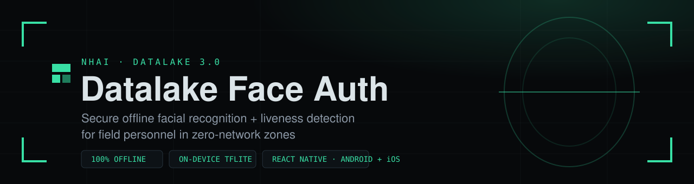
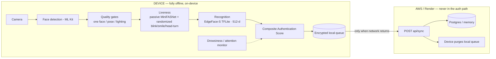
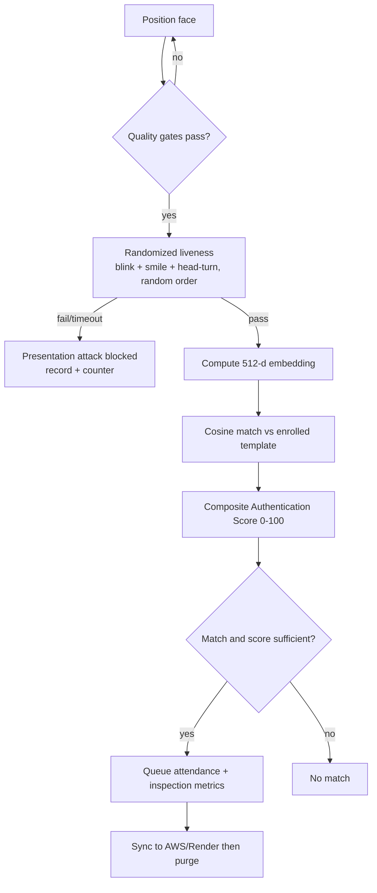
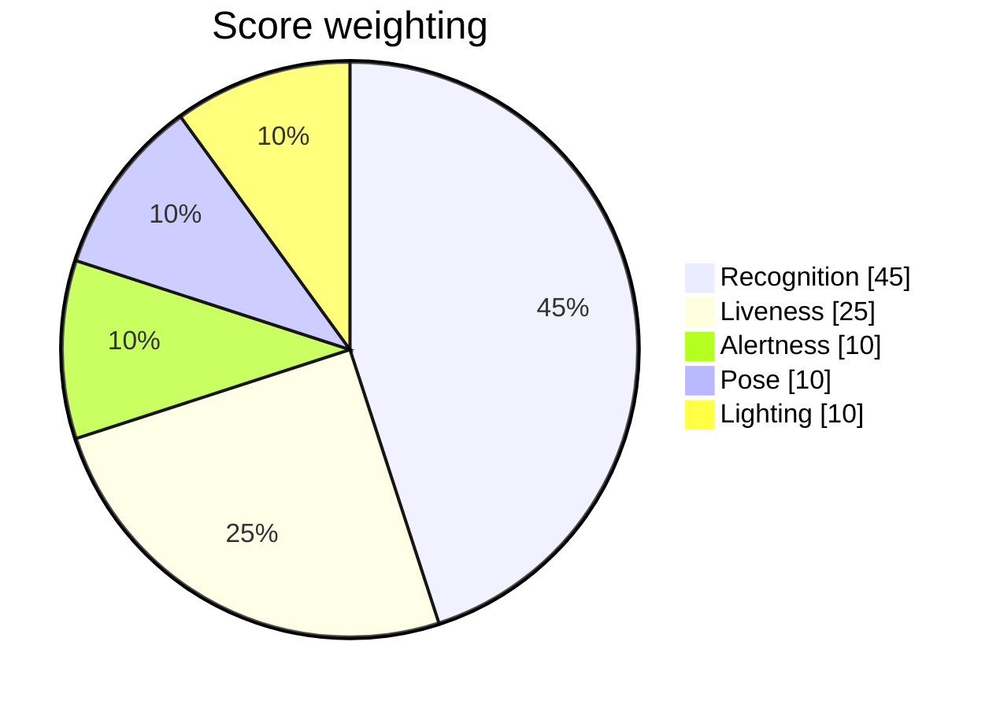

<div align="center">



<br/><br/>


### &nbsp;[▶ Live demo](https://nhai-three.vercel.app)&nbsp; · &nbsp;[⬇ Download APK](https://github.com/perrysolid/NHAI/raw/main/docs/deliverables/DatalakeFaceAuth-android-universal-release.apk)&nbsp; · &nbsp;[◱ Admin dashboard](https://datalake-face-sync.onrender.com/admin)&nbsp; · &nbsp;[Demo video](https://drive.google.com/drive/folders/14rTxUjJ_Wrdt349yWkksgE51m87zO97d?usp=sharing)&nbsp;

<sub>NHAI Innovation Hackathon 7.0 · Datalake 3.0 &nbsp;|&nbsp; MIT / Apache-2.0 &nbsp;|&nbsp; [package notes](docs/deliverables/README.md)</sub>

</div>

---

> **Note for judges.** The mandatory, spec-compliant deliverable is the **React Native app** in [`app/`](app) — it runs face detection, a randomized liveness challenge, and recognition **fully on-device** with bundled TFLite models. The **Vercel browser app** mirrors the same pipeline for instant demonstration (no install).

## Judges flow (NHAI Hackathon 7.0)

1. **Install** the offline APK on any Android 8+ phone — [download](https://github.com/perrysolid/NHAI/raw/main/docs/deliverables/DatalakeFaceAuth-android-universal-release.apk) (`adb install -r ...universal-release.apk`).
2. **Enroll** — tap *Enroll*, enter or generate an inspector ID, then just **center your face in the ring**. It turns **green** the moment your face is centered and all 3 samples **auto-capture** — no buttons to press — saving the template **on the phone**.
3. **Verify** — tap *Verify* and **center your face**; verification **starts automatically** (no tap). Complete the random liveness prompts (**blink / smile / turn**, random order). Match returns in **< 1s**, with an authentication score — all on-device.

> **Fully hands-free.** Capture and verification trigger automatically once your face is centred (the ring turns green) — you never tap a capture/verify button. The on-screen *Capture* / *Start verify* buttons remain only as a manual fallback.
4. **Spoof test** — hold up a **printed photo or a static image on another phone**: liveness is **rejected** (it cannot complete the live random sequence). *Scope: printed photos, static screen images, and slow/naive video loops are blocked. A deliberately tight video loop, a live video-call relay, and virtual-camera injection are* ***not*** *blocked in this build — see [the measured breakdown](docs/NHAI_HACKATHON_ALIGNMENT.md#honest-scope-of-the-anti-spoof).*
5. **Offline proof** — turn on **airplane mode** and repeat steps 2–3: enrolment and verification still work; nothing leaves the device.
6. **No install?** Open the [browser demo](https://nhai-three.vercel.app) to try the same pipeline instantly. *(Demonstration only; the APK is the deliverable.)*

## The problem

> *"How can we accurately and securely authenticate field personnel using facial recognition and liveness detection on standard mid-range mobile devices without any active internet connection, while ensuring the AI model remains lightweight and seamlessly integrates with a React Native application on both Android and iOS devices?"*

## Architecture



The cloud side is **only** an offline→online sync target for the sync-and-purge step. No recognition ever happens server-side; the device decides authentication entirely offline, then syncs the verified record and purges locally.

## Authentication pipeline



## Composite Authentication Score

Instead of a single distance number, every signal is normalized to a sub-score, multiplied by a transparent weight, and summed into one **Authentication Score (0–100)**:



Weights live in `config.ts` (`SCORING`) and are identical on native and web (`app/src/face/scoring.ts`, `web/src/lib/scoring.ts`). Scores below 70 are flagged **low-trust** for review.

## Requirement compliance

| # | Requirement | Status | Where |
|---|-------------|--------|-------|
| 1 | React Native, Android **and** iOS | Met (Android release APK builds; iOS project included) | [`app/`](app) |
| 2 | Lightweight model ~20 MB | **19.9 MB** TFLite (EdgeFace-S 14.2 float32 + MiniFASNetV2 5.7) | [`app/assets/models`](app/assets/models) |
| 3 | < 1 s recognize + liveness | On-device latency budget shown per verify; benchmark hooks | `benchmark/`, web stat strip |
| 4 | Android 8.0+, no GPU, 3 GB RAM | `minSdk 26`, CPU TFLite delegate, ABI-split APKs | `android/` |
| 5 | > 95% accuracy, Indian demographics, outdoor light | Compact ArcFace baseline; quality gates bound pose, face size and exposure, and illumination feeds the composite score. IndicFairFace fine-tune documented as the next step | [`docs/NHAI_HACKATHON_ALIGNMENT.md`](docs/NHAI_HACKATHON_ALIGNMENT.md) |
| 6 | Open-source only, source shared | All deps MIT / Apache-2.0; full source in repo | this repo |
| D1 | Working cross-platform prototype | React Native app | [`app/`](app) |
| D1a | Offline liveness (blink/smile/turn) | Passive MiniFASNet + active challenge | `app/src/face/liveness.ts` |
| D1b | Sync & purge after network returns | Queue → POST → purge on ack (AWS/Render) | `app/src/sync`, [`backend/`](backend) |
| D2 | Documentation + benchmarks | Full `docs/` set incl. architecture & methodology | [`docs/`](docs) |

> **Honest validation boundary:** `>95%` accuracy and `<1s` latency are backed by the chosen model architectures and on-device latency instrumentation; final numbers should be measured on a target mid-range device with a representative Indian-demographic set. iOS floor is **15.5** (required by the on-device ML Kit face detector), noted against the spec's iOS 12+. See [`docs/NHAI_HACKATHON_ALIGNMENT.md`](docs/NHAI_HACKATHON_ALIGNMENT.md).

## Bonus features (beyond the brief)

- **On-device geofencing (at-site presence)** — face proves *who* and *live*; a geofenced GPS fix proves *where*. At verify the device checks its location against the assigned site (circle or chainage polygon), rejects **mock/fake-GPS** fixes (`isFromMockProvider`) and low-accuracy reads, and stamps `lat/lon/accuracy/geofencePassed/siteId` onto the record. Fully offline (GPS is satellite-based); the backend re-checks server-side. See `app/src/location/`.
- **Composite Authentication Score** — weighted, transparent 0–100 trust score across all signals.
- **On-device drowsiness & attention monitoring** — EAR, PERCLOS, blink rate, micro-sleep, head look-away (no extra model). See [`docs/MONITORING_AND_DASHBOARD.md`](docs/MONITORING_AND_DASHBOARD.md).
- **Bilingual voice prompts (English + हिन्दी)** — offline Web Speech API on web; static bilingual prompts on native. No translation API, no network.
- **Verifiable offline proof** — a live "Auth network: 0 calls" counter shows zero network requests during authentication.
- **On-device latency budget** — recognize + match milliseconds shown per verification, proving the `<1 s` target.
- **Presentation-attack counter** — blocked liveness attempts counted on-device.
- **Operations-ready sync records** — verified records include score, latency, liveness, and inspection metrics for downstream analytics.

## Repository layout

| Path | Role | Stack |
|------|------|-------|
| [`app/`](app) | **Primary deliverable** — offline RN app (Android + iOS) | React Native 0.74, vision-camera, react-native-fast-tflite, ML Kit, MMKV |
| [`web/`](web) | Optional browser mirror retained for development comparison | Vite + React, @vladmandic/face-api, Web Speech API |
| [`backend/`](backend) | Offline→online sync-and-purge target (AWS / Render) | Node + Express, optional Postgres |
| [`docs/`](docs) | Plan, integration guide, methodology, deployment, alignment | — |

## Judge mobile package

Android release APKs are included in [`docs/deliverables/`](docs/deliverables). Judges can use the single universal APK directly:

**Direct APK link:** https://github.com/perrysolid/NHAI/raw/main/docs/deliverables/DatalakeFaceAuth-android-universal-release.apk

**Latest build: `v4.2` (versionCode 36)** — verified with `aapt dump badging`.
SHA-256 checksums for all three APKs are in
[`docs/deliverables/README.md`](docs/deliverables/README.md).

| Platform | File | Size | Use |
|----------|------|------|-----|
| Android universal | [`…-universal-release.apk`](docs/deliverables/DatalakeFaceAuth-android-universal-release.apk) | 82 MB | One APK for judge phones: arm64-v8a + armeabi-v7a |
| Android 64-bit | [`…-arm64-v8a-release.apk`](docs/deliverables/DatalakeFaceAuth-android-arm64-v8a-release.apk) | 63 MB | Modern phones — smaller download |
| Android 32-bit | [`…-armeabi-v7a-release.apk`](docs/deliverables/DatalakeFaceAuth-android-armeabi-v7a-release.apk) | 53 MB | Older 32-bit phones |

```bash
adb install -r docs/deliverables/DatalakeFaceAuth-android-universal-release.apk
```

iOS does **not** use APK files. The iOS equivalent is a signed `.ipa` or TestFlight build. The project is included at [`app/ios/DatalakeFaceAuth.xcodeproj`](app/ios/DatalakeFaceAuth.xcodeproj); archive/export requires an Apple Developer Team, signing certificate, and provisioning profile.

## Models (on-device, < 20 MB)

| Model | Role | Size | License |
|-------|------|------|---------|
| **EdgeFace-S (TFLite, float32)** | recognition — 112×112 → 512-d ArcFace embedding | 14.2 MB | open-source |
| **MiniFASNetV2 (TFLite)** | passive anti-spoof — 80×80 BGR, 3-class | 5.7 MB | Apache-2.0 |
| Motion-parallax structure check | 3D liveness from landmark geometry — no model file | 0 MB | this project |

Bundled total is **19.9 MB**, inside the 20 MB brief. A float16 or INT8 re-quantisation of
EdgeFace-S is the documented headroom lever; note that templates are not portable across
model changes, so a swap forces re-enrollment.

ML Kit provides on-device face detection + landmarks (blink/smile/head-pose) for the active liveness challenge and the attention monitor.

## Run it locally

<details>
<summary><b>React Native app (Android / iOS)</b></summary>

```bash
cd app
npm install
# Android (needs JDK 17 + emulator/device; project pins JDK 17 via gradle.properties):
npx react-native run-android
# iOS (macOS + Xcode + CocoaPods):
cd ios && pod install && cd .. && npx react-native run-ios
```
Models go in `app/assets/models/` (see its README for download + netron-verify steps).
</details>

<details>
<summary><b>Backend service (optional development only)</b></summary>

```bash
cd backend && npm install && npm run build && npm start
```
</details>

## Deploy

- **Backend → Render:** one-click via [`render.yaml`](render.yaml).
- **Backend → AWS:** App Runner / Elastic Beanstalk / ECS / EC2 via [`backend/Dockerfile`](backend/Dockerfile) + [`backend/apprunner.yaml`](backend/apprunner.yaml). See [`docs/AWS_DEPLOYMENT.md`](docs/AWS_DEPLOYMENT.md).
- Full steps: [`docs/WEB_RENDER_DEPLOYMENT.md`](docs/WEB_RENDER_DEPLOYMENT.md).

## Live deployment

Everything below is deployed and reachable right now.

| Surface | URL | Access |
|---------|-----|--------|
| **Admin dashboard** (ops console) | **https://datalake-face-sync.onrender.com/admin** | `?key=<ADMIN_PASSCODE>` — passcode shared privately, **not** in this repo |
| Browser demo | https://nhai-three.vercel.app | public |
| Sync backend | https://datalake-face-sync.onrender.com | `/health` is public; API routes need a key |
| Android APK | [universal release](https://github.com/perrysolid/NHAI/raw/main/docs/deliverables/DatalakeFaceAuth-android-universal-release.apk) | public — `v4.2` build 36 |

### Admin dashboard

Server-rendered operations console for synced attendance — no client framework,
loads on a field connection. It surfaces the records an operator actually needs
to look at: drowsiness (PERCLOS / micro-sleep), inattention (look-away), weak
matches, and poor capture quality, alongside per-site presence.

```
https://datalake-face-sync.onrender.com/admin?key=<ADMIN_PASSCODE>
```

> **Credentials are deliberately not committed.** This repository is public, so
> `ADMIN_PASSCODE`, `ADMIN_USER`, and `ADMIN_PASSWORD` live only in the Render
> environment and are shared with the team through a private channel. Requesting
> `/admin` without a valid passcode returns `401`.

There is also a JSON admin API behind `POST /api/admin/login`, which issues an
ephemeral token for `GET /api/records`, `GET /api/enrollments`, and the site CRUD
routes — see the [Backend API](#backend-api) table.

> **First request may take ~30 s.** The backend runs on Render's free tier and
> sleeps when idle; the next request is immediate. This affects the dashboard and
> sync only — **never authentication**, which is entirely on-device.

## Demo Routes And Keys

The public Vercel demo is a single-page app with direct routes enabled in
[`web/vercel.json`](web/vercel.json), so these URLs can be shared with judges:

| Route | Purpose |
|-------|---------|
| `/` | Live browser authentication demo: enroll, liveness, verify, queue, sync |
| `/operations` | Demo operations view: pending queue, enrollments, sync posture |
| `/deployment` | Vercel + backend deployment settings and runtime checks |
| `/aws` | AWS-specific setup: App Runner/RDS routes, secrets, client key placement |

### Backend API

Two independent credentials, both sent as `x-api-key`: the shared **device** key
(`API_KEY`) and an **admin** token from `POST /api/admin/login`. The key baked
into the app binary does **not** grant admin access. Both guards **fail closed** —
unset credentials return `503` and the process refuses to start.

| Backend route | Auth | Purpose |
|---------------|------|---------|
| `GET /health` | none | Health check (Render/AWS probe) |
| `POST /api/sync` | device | Receive verified attendance records → `{accepted, rejected, acceptedRecords}` |
| `GET /api/records` | **admin** | Recent synced records (`since` + `limit ≤ 1000`) |
| `POST /api/admin/login` | none | `{username, password}` → ephemeral token |
| `POST /api/enroll` | device | Upsert `{userId, role, embedding[], deviceId}` |
| `GET /api/enrollments` | **admin** | Full enrollment registry |
| `GET /api/enrollments/for/:userId` | device | Pull a template to verify that inspector offline |
| `DELETE /api/enrollments/:userId` | **admin** | Remove an enrollment |
| `GET /api/sites` · `POST /api/sites` · `DELETE /api/sites/:id` | **admin** | Geofence site CRUD |
| `GET /api/sites/for/:userId` | device | Assigned sites, cached in MMKV for offline use |
| `GET /admin?key=…` | `ADMIN_PASSCODE` | Server-rendered ops console |

Where to add keys and cloud URLs:

| Target | File or environment | Values |
|--------|---------------------|--------|
| Vercel frontend | Vercel project env vars | `VITE_SYNC_URL=https://<aws-or-render-backend>` and `VITE_SYNC_KEY=<same as API_KEY>` |
| AWS backend | App Runner / ECS / EB env vars | `API_KEY`, `CORS_ORIGIN=https://<vercel-app>.vercel.app`, optional `DATABASE_URL` |
| Render backend | Render env vars | same as AWS backend |
| Native app | [`app/src/config.ts`](app/src/config.ts) | `SYNC.url=https://<backend>/api/sync`, `SYNC.apiKey=<same as API_KEY>` |
| Browser defaults | [`web/src/lib/config.ts`](web/src/lib/config.ts) | local fallback only; production values should come from Vercel env vars |

## Verification status

Last run on commit `c688a23`, build `v4.2` (versionCode 36) — see
[`docs/TEST_REPORT.md`](docs/TEST_REPORT.md) for the full output.

| Package | Type-check | Lint | Tests | Build |
|---------|-----------|------|-------|-------|
| `app/` (native) | clean | 0 errors (4 style warnings) | **150 unit tests pass** (16 suites) | Android release APKs build (82 MB universal / 63 MB arm64 / 53 MB armv7) |
| `backend/` | clean | — | **58 tests pass** (14 suites) | `tsc` build clean |
| `web/` | clean | clean | 4 Playwright E2E pass | Vite production build |

The live backend was checked at the same time: `GET /health` returns
`{"ok":true,"store":"postgres"}`, and `GET /admin` without a passcode returns
`401`.

## Documentation

Start with the technical documentation for "how does X work", and the alignment
matrix before making any compliance claim.

| Document | What it covers |
|----------|----------------|
| [Technical documentation](docs/TECHNICAL_DOCUMENTATION.md) | **The deep reference** — per-module detail, pipeline walkthrough, file index |
| [NHAI hackathon alignment](docs/NHAI_HACKATHON_ALIGNMENT.md) | Requirement matrix, model decision record, and the **honest gap list** — read before any compliance claim |
| [Test report](docs/TEST_REPORT.md) | Verified test/build results for the current commit, with APK hashes |
| [Judge mobile package](docs/deliverables/README.md) | APK install notes, build contents, iOS packaging steps |
| [Datalake 3.0 integration guide](docs/DATALAKE_INTEGRATION_GUIDE.md) | Attendance record contract |
| [Drowsiness & attention monitoring](docs/MONITORING_AND_DASHBOARD.md) | Alertness metrics and the ops view |
| [Sharding, proxy & integrity](docs/SHARDING_PROXY_INTEGRITY.md) | Server-side integrity guard and the (unimplemented) edge proxy design |
| [Supabase setup](docs/SUPABASE.md) | Using Supabase as the durable store |
| [AWS deployment](docs/AWS_DEPLOYMENT.md) | App Runner / ECS / EB / EC2 + RDS |
| [Web + Render deployment](docs/WEB_RENDER_DEPLOYMENT.md) | Vercel frontend + Render backend |
| [Implementation plan](docs/IMPLEMENTATION_PLAN.md) | Historical — kept for provenance, superseded on model choice |
| [`CLAUDE.md`](CLAUDE.md) | Contributor contract: invariants, commands, anti-spoof rules, scale roadmap |
| [`finetune/README.md`](finetune/README.md) | EdgeFace-S → IndicFairFace fine-tune → TFLite pipeline |

## Privacy & security

Authentication is fully offline; **no image or video ever leaves the device**. Only face *embeddings* (not images) are stored, in encrypted MMKV on native. After a successful verification, only the scalar attendance record + inspection summary is synced, then the local queue is purged.

## License & open-source credits

All third-party components are open-source with no additional licensing required:
React Native, react-native-vision-camera, react-native-fast-tflite, ML Kit face detection, MMKV (MIT); EdgeFace / MiniFASNet (open-source / Apache-2.0); @vladmandic/face-api (MIT); Express, Vite, React (MIT).
