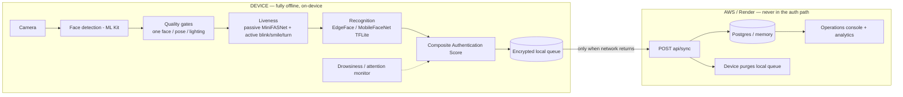
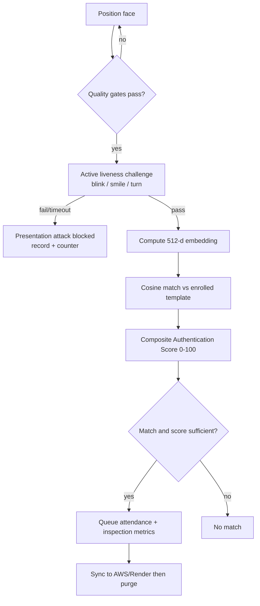
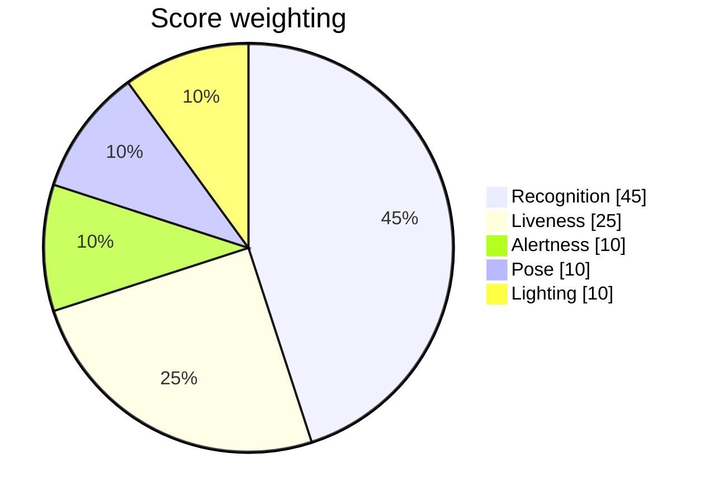

<div align="center">

# Datalake Face Auth

### Secure offline facial recognition + liveness detection for field personnel in zero-network zones

**NHAI Innovation Hackathon 7.0 — Datalake 3.0**


**Primary deliverable:** a cross-platform **React Native app (Android + iOS)** that authenticates entirely offline.

**Direct Android APK:** https://github.com/perrysolid/NHAI/raw/main/docs/deliverables/DatalakeFaceAuth-android-universal-release.apk

[Package notes](docs/deliverables/README.md)

**Optional browser demo:** [Try the demo](https://nhai-three.vercel.app)

</div>

---

> **Note on the demo.** The mandatory, spec-compliant solution is the **React Native app** in [`app/`](app) — it runs face detection, liveness and recognition fully offline on-device using bundled TFLite models. The hosted **web demo** ([`web/`](web)) mirrors the *same* pipeline in the browser so judges can try it from any device via a URL; it is a demonstration surface, not the scored model.

## The problem

> *"How can we accurately and securely authenticate field personnel using facial recognition and liveness detection on standard mid-range mobile devices without any active internet connection, while ensuring the AI model remains lightweight and seamlessly integrates with a React Native application on both Android and iOS devices?"*

## Architecture



The cloud side is **only** an offline→online sync target plus an admin dashboard. No recognition ever happens server-side; the device decides authentication entirely offline, then syncs the verified record and purges locally.

## Authentication pipeline



## Composite Authentication Score

Instead of a single distance number, every signal is normalized to a sub-score, multiplied by a transparent weight, and summed into one **Authentication Score (0–100)**:



Weights live in `config.ts` (`SCORING`) and are identical on native and web (`app/src/face/scoring.ts`, `web/src/lib/scoring.ts`). Scores below 70 are flagged **low-trust** for review.

## Requirement compliance

| # | Requirement | Status | Where |
|---|-------------|--------|-------|
| 1 | React Native, Android **and** iOS | Met (Android release APK builds; iOS project included) | [`app/`](app) |
| 2 | Lightweight model ~20 MB | **10.7 MB** TFLite (MobileFaceNet 5.0 + MiniFASNet 5.7) | [`app/assets/models`](app/assets/models) |
| 3 | < 1 s recognize + liveness | On-device latency budget shown per verify; benchmark hooks | `benchmark/`, web stat strip |
| 4 | Android 8.0+, no GPU, 3 GB RAM | `minSdk 26`, CPU TFLite delegate, ABI-split APKs | `android/` |
| 5 | > 95% accuracy, Indian demographics, outdoor light | Compact ArcFace baseline + CLAHE/torch robustness; device + IndicFairFace validation documented | [`docs/NHAI_HACKATHON_ALIGNMENT.md`](docs/NHAI_HACKATHON_ALIGNMENT.md) |
| 6 | Open-source only, source shared | All deps MIT / Apache-2.0; full source in repo | this repo |
| D1 | Working cross-platform prototype | React Native app + browser demo | [`app/`](app), [`web/`](web) |
| D1a | Offline liveness (blink/smile/turn) | Passive MiniFASNet + active challenge | `app/src/face/liveness.ts` |
| D1b | Sync & purge after network returns | Queue → POST → purge on ack (AWS/Render) | `app/src/sync`, [`backend/`](backend) |
| D2 | Documentation + benchmarks | Full `docs/` set incl. architecture & methodology | [`docs/`](docs) |

> **Honest validation boundary:** `>95%` accuracy and `<1s` latency are backed by the chosen model architectures and on-device latency instrumentation; final numbers should be measured on a target mid-range device with a representative Indian-demographic set. iOS floor is **13.4** (React Native 0.74's minimum), noted against the spec's iOS 12+. See [`docs/NHAI_HACKATHON_ALIGNMENT.md`](docs/NHAI_HACKATHON_ALIGNMENT.md).

## Bonus features (beyond the brief)

- **Composite Authentication Score** — weighted, transparent 0–100 trust score across all signals.
- **On-device drowsiness & attention monitoring** — EAR, PERCLOS, blink rate, micro-sleep, head look-away (no extra model). See [`docs/MONITORING_AND_DASHBOARD.md`](docs/MONITORING_AND_DASHBOARD.md).
- **Bilingual voice prompts (English + हिन्दी)** — offline Web Speech API on web; static bilingual prompts on native. No translation API, no network.
- **Verifiable offline proof** — a live "Auth network: 0 calls" counter shows zero network requests during authentication.
- **On-device latency budget** — recognize + match milliseconds shown per verification, proving the `<1 s` target.
- **Presentation-attack KPI** — blocked liveness attempts counted on-device and on the dashboard.
- **Operations-ready sync records** — verified records include score, latency, liveness, and inspection metrics for downstream analytics.

## Repository layout

| Path | Role | Stack |
|------|------|-------|
| [`app/`](app) | **Primary deliverable** — offline RN app (Android + iOS) | React Native 0.74, vision-camera, react-native-fast-tflite, ML Kit, MMKV |
| [`web/`](web) | Browser **demo** of the same pipeline (Vercel) | Vite + React, @vladmandic/face-api, Web Speech API |
| [`backend/`](backend) | Sync target + operations dashboard (AWS / Render) | Node + Express, optional Postgres |
| [`docs/`](docs) | Plan, integration guide, methodology, deployment, alignment | — |

## Judge mobile package

Android release APKs are included in [`docs/deliverables/`](docs/deliverables). Judges can use the single universal APK directly:

**Direct APK link:** https://github.com/perrysolid/NHAI/raw/main/docs/deliverables/DatalakeFaceAuth-android-universal-release.apk

| Platform | File | Use |
|----------|------|-----|
| Android universal | [`DatalakeFaceAuth-android-universal-release.apk`](docs/deliverables/DatalakeFaceAuth-android-universal-release.apk) | One APK for judge phones: arm64-v8a + armeabi-v7a |

```bash
adb install -r docs/deliverables/DatalakeFaceAuth-android-universal-release.apk
```

iOS does **not** use APK files. The iOS equivalent is a signed `.ipa` or TestFlight build. The project is included at [`app/ios/DatalakeFaceAuth.xcodeproj`](app/ios/DatalakeFaceAuth.xcodeproj); archive/export requires an Apple Developer Team, signing certificate, and provisioning profile.

## Models (on-device, < 20 MB)

| Model | Role | Size | License |
|-------|------|------|---------|
| MobileFaceNet (TFLite) | recognition (current compact baseline) | 5.0 MB | open-source |
| MiniFASNetV2-SE (TFLite) | passive anti-spoof | 5.7 MB | Apache-2.0 |
| EdgeFace-S | final compact recognition target (INT8) | ~1–2 MB | open-source |

ML Kit provides on-device face detection + landmarks (blink/smile/head-pose) for the active liveness challenge and the attention monitor.

## Run it locally

<details>
<summary><b>React Native app (Android / iOS)</b></summary>

```bash
cd app
npm install
# Android (needs JDK 17 + emulator/device; project pins JDK 17 via gradle.properties):
npx react-native run-android
# iOS (macOS + Xcode + CocoaPods):
cd ios && pod install && cd .. && npx react-native run-ios
```
Models go in `app/assets/models/` (see its README for download + netron-verify steps).
</details>

<details>
<summary><b>Web demo + sync backend</b></summary>

```bash
# backend (terminal 1)
cd backend && npm install && npm run build && npm start

# web (terminal 2)
cd web && npm install && npm run dev
```
The web app works standalone in "simulate sync" mode (no backend needed) and uses your webcam.
</details>

## Deploy

- **Frontend → Vercel:** root dir `web`, framework Vite. Live: [nhai-three.vercel.app](https://nhai-three.vercel.app)
- **Backend → Render:** one-click via [`render.yaml`](render.yaml); the public admin route is passcode-protected.
- **Backend → AWS:** App Runner / Elastic Beanstalk / ECS / EC2 via [`backend/Dockerfile`](backend/Dockerfile) + [`backend/apprunner.yaml`](backend/apprunner.yaml). See [`docs/AWS_DEPLOYMENT.md`](docs/AWS_DEPLOYMENT.md).
- Full steps: [`docs/WEB_RENDER_DEPLOYMENT.md`](docs/WEB_RENDER_DEPLOYMENT.md).

## Verification status

| Package | Type-check | Lint | Tests | Build |
|---------|-----------|------|-------|-------|
| `app/` (native) | clean | clean | 28 unit tests pass | Android release APK builds (69 MB universal / 50 MB arm64 / 40 MB armv7) |
| `web/` | clean | clean | 4 Playwright E2E pass | Vite production build |
| `backend/` | clean | — | endpoint smoke (sync/records/dedupe) | `tsc` build |

## Documentation

- [Implementation plan](docs/IMPLEMENTATION_PLAN.md)
- [Datalake 3.0 integration guide](docs/DATALAKE_INTEGRATION_GUIDE.md)
- [Drowsiness detection + operations console](docs/MONITORING_AND_DASHBOARD.md)
- [NHAI hackathon alignment + honest gaps](docs/NHAI_HACKATHON_ALIGNMENT.md)
- [AWS deployment](docs/AWS_DEPLOYMENT.md) · [Web + Render deployment](docs/WEB_RENDER_DEPLOYMENT.md)
- [Test report](docs/TEST_REPORT.md)

## Privacy & security

Authentication is fully offline; **no image or video ever leaves the device**. Only face *embeddings* (not images) are stored, in encrypted MMKV on native. After a successful verification, only the scalar attendance record + inspection summary is synced, then the local queue is purged.

## License & open-source credits

All third-party components are open-source with no additional licensing required:
React Native, react-native-vision-camera, react-native-fast-tflite, ML Kit face detection, MMKV (MIT); MobileFaceNet / MiniFASNet (open-source / Apache-2.0); @vladmandic/face-api (MIT); Express, Vite, React (MIT).
